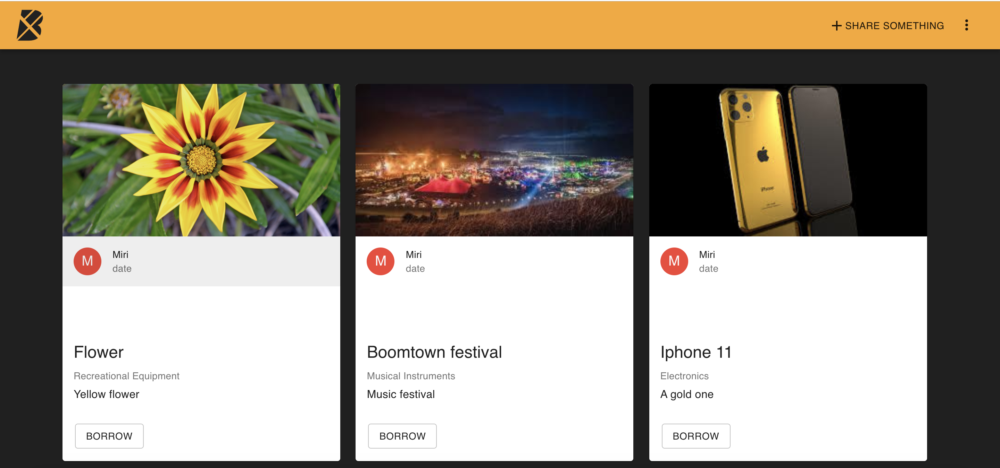
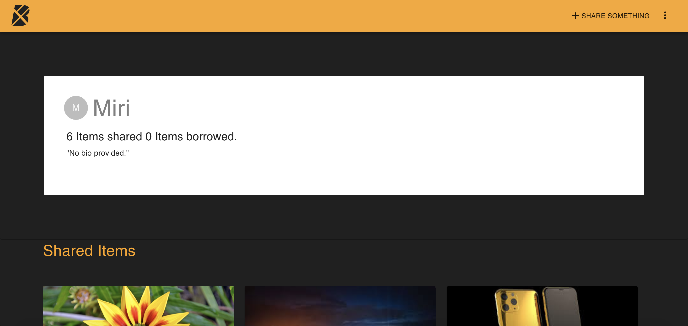

# Boomtown 🏙

## Description
Create the front-end UI of a web-based application to support a local sharing economy. 
Functionally, the app will allow users to browse all items and user profiles, and also share items of their own and request to borrow items from other users.

## Screenshots




## Technologies Used
* React
* Javascript
* PostgreSQL as a relational database to store shareable items and user info.
* Node.js/Express as its web server.
* GraphQL for its client-facing API.
* Apollo Server and Client.
* Material UI library.

## Server

Commands must be run from the `server` directory:

### Installation

```bash
npm install
```

### Run

```bash
npm start
```

## Client

Commands must be run from the `client` directory:

### Installation

```bash
npm install
```

### Run

```bash
npm run start:dev
```
